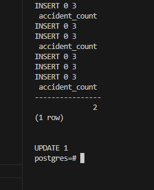
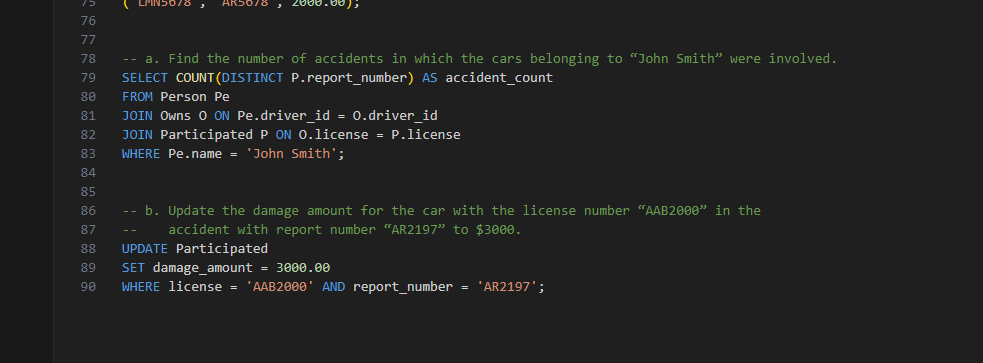

# DSC-E3.14

figure 3.18
Person (driver_id, name, address)
Car (license, model, year)
Accident (report_number, date, location)
Owns (driver_id, license)
Participated (license, report_number, damage_amount)

Consider the insurance database of Figure 3.18, where the primary keys are underlined. Construct the following SQL queries for this relational database:

a. Find the number of accidents in which the cars belonging to “John Smith” were involved.

b. Update the damage amount for the car with the license number “AAB2000” in the accident with report number “AR2197” to $3000.

